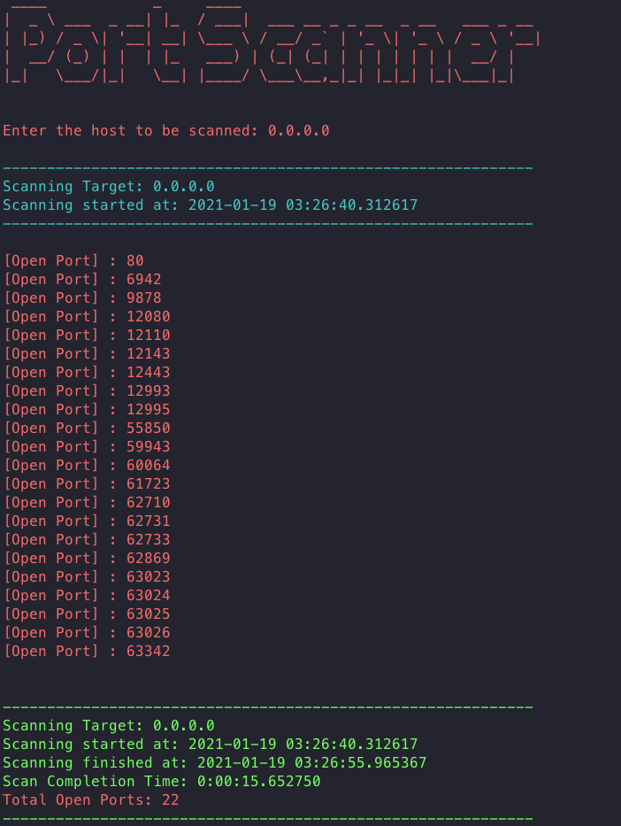

#PScan Port Scanner

The purpose of PScan is to provide you with information about the port number and total open ports on your system.

##How to use

You can run it from the terminal.

```
python3 /your/file/directory/main.py
```

